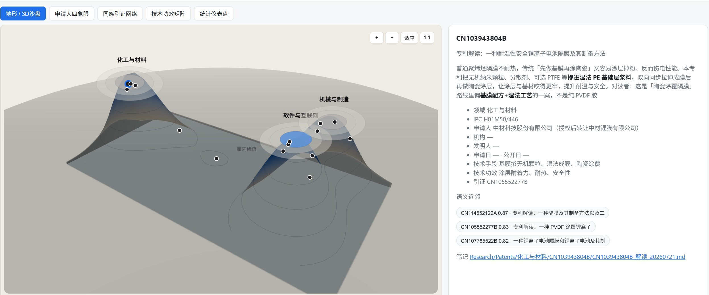

<div align="center">

# 中国专利技能套件（智慧芽 MCP 增强）

<<<<<<< HEAD
> 专利点挖掘与交底书（发明/实用/外观）编写，已有交底改写成申请文件，交底到申请可以一起做，**智慧芽 MCP 语义检索 + 著录检索 + 同族/引证分析**，通俗解读专利，对照审查口径出政策简报，辅助审查答复，**全景分析与 FTO 风险检索**。
=======
> 专利点挖掘、交底书（发明/实用/外观）与申请文件编写；按图或权要等多条件检索；通俗解读专利和地图探索；审查政策解读；辅助审查答复。
>>>>>>> upstream/main

[](LICENSE)
[](https://www.python.org/)
[](https://www.zhihuiya.com/)
[](https://agentskills.io)

<br>

基于 [handsomestWei/patent-disclosure-skill](https://github.com/handsomestWei/patent-disclosure-skill) 衍生，**核心改造：将 Playwright 爬虫检索替换为智慧芽 MCP 工具链**，覆盖专利全生命周期。

[改造说明](#改造说明) · [子技能列表](#子技能列表) · [安装说明](#安装说明) · [技能入口](SKILL.md) · [原始项目](https://github.com/handsomestWei/patent-disclosure-skill)

</div>

---

## 改造说明

本项目基于 [handsomestWei/patent-disclosure-skill](https://github.com/handsomestWei/patent-disclosure-skill)（MIT License © handsomestWei）衍生，在保留原有全流程专利撰写能力的基础上，**将检索层从 Playwright 爬虫升级为智慧芽 MCP 工具链**。

### 核心改造对照

| 维度 | 原项目 | 本项目（智慧芽 MCP 增强） |
|------|--------|--------------------------|
| **交底查新** | Playwright 爬 CNIPA 一词一页 + 两轮分类号收口 | 智慧芽 `patsnap-search.patsnap_search` 语义检索，覆盖专利+文献 |
| **著录检索** | Playwright 爬 CNIPA 公布公告站，受 WAF/验证码影响 | 智慧芽 `core-patents.search_patents` + `bibliography`，结构化 JSON |
| **检索覆盖** | 仅中国公布公告 | 全球专利 + 科技文献 |
| **同族/引证** | 不做 | `core-patents.family` + `forward_citation` |
| **法律状态** | 不做 | `patent-status.legal_data` + `fee_info` |
| **FTO 检索** | 不做 | `patsnap-ip-searching.fto_review`（二期扩展） |
| **全景分析** | 不做 | `patent-landscape.search_patents_v3`（二期扩展） |
| **CNIPA 降级** | 主路径 | 保留为无 MCP 环境的降级回退 |
| **Eureka 兼容** | 无 manifest | 新增 `skill.manifest.json` |

### 保留不变

以下设计是原项目的核心价值，**完整保留**：

<<<<<<< HEAD
- **显式触发门禁**：申请文件、案卷、审查答复、政策简报须显式触发，防止 Agent 越权产出
- **机读前缀协议**：`EPUB_HITS_JSON:` / `EPUB_SEARCH_MD:` 等，解决 Windows PowerShell 判读歧义
- **问题清单机制**：内容争议写入问题清单，不阻塞主文件产出，最多三轮来回
- **案卷会稿角色扮演**：交底工程师 vs 专利代理师自主多轮规划
- **附图能力**：产品图→外观线稿、结构图→实用新型线稿、CAD STEP→多视角投影
- **Obsidian 知识库集成**：专利解读入库 Obsidian，双链+图谱+Bases
- **跨包隔离原则**：每个子技能自带工具副本，禁止跨包调用
=======
公开专利常把阅读门槛抬得很高：权要绕、术语密、落地语境散落在说明书与附图里。本技能把单篇读成通俗笔记与图谱，并入库 Obsidian；依托双链、图谱、插件与 Bases 等生态，陆续解读的专利可以沉淀成**只属于自己的私有专利知识库**——权要、术语、线索与附图彼此勾连，越读越厚。再叠上 [Obsidian CLI](https://help.obsidian.md/cli) 与库内外连接能力，检索、批处理、和外部工具接力都更容易：从单篇通俗笔记，走向可检索、可关联、可继续生长的个人专利情报层，把沉睡在 PDF 里的技术细节重新点亮。库厚了之后，还能在这层之上做**专利比对、挖掘与分析**——同族对照、技术路线梳理、差异点扫描，把「读懂」推进到「用起来」。

---

## 运行效果

### 专利交底书编写

<table width="100%" border="1" cellpadding="12" cellspacing="0">
<tr>
<th width="50%" align="center">初版生成<br><sub>首次落盘交付</sub></th>
<th width="50%" align="center">迭代更新<br><sub>多版本并存 + 对话记录</sub></th>
</tr>
<tr>
<td width="50%" valign="top" align="center">

</td>
<td width="50%" valign="top" align="center">

</td>
</tr>
</table>

### 实用新型 / 外观 · 看图与出图

<table width="100%" border="1" cellpadding="12" cellspacing="0">
<tr>
<th width="33%" align="center">外观线稿<br><sub>从产品图自动提炼造型轮廓</sub></th>
<th width="33%" align="center">实用新型线稿<br><sub>从结构图自动生成轮廓与部件序号引出</sub></th>
<th width="34%" align="center">CAD 三维模型投影<br><sub>从工程模型自动提取等轴测等多视角</sub></th>
</tr>
<tr>
<td width="33%" valign="top" align="center">

</td>
<td width="33%" valign="top" align="center">

</td>
<td width="34%" valign="top" align="center">

</td>
</tr>
</table>

### 专利通俗解读 · 地图探索

<table width="100%" border="1" cellpadding="12" cellspacing="0">
<tr>
<th width="33%" align="center">Obsidian 关系图<br><sub>知识图谱与多色节点</sub></th>
<th width="33%" align="center">解读 Canvas<br><sub>叙事故事线 · 术语 · 公开线索</sub></th>
<th width="34%" align="center">专利地图<br><sub>地形沙盘 · 四象限 · 引证网络 · 功效矩阵</sub></th>
</tr>
<tr>
<td width="33%" valign="top" align="center">

</td>
<td width="33%" valign="top" align="center">

</td>
<td width="34%" valign="top" align="center">

</td>
</tr>
</table>
>>>>>>> upstream/main

---

## 子技能列表

<table width="100%">
<colgroup>
<col width="22%">
<col width="10%">
<col>
<col width="18%">
</colgroup>
<thead>
<tr>
<th align="left">技能</th>
<th align="left">名称</th>
<th align="left">能力</th>
<th align="left">触发</th>
</tr>
</thead>
<tbody>
<tr>
<td nowrap><a href="skills/patent-disclosure/README.md"><code>patent-disclosure</code></a></td>
<td nowrap>交底书编写</td>
<<<<<<< HEAD
<td>材料丢进来，挖出真正能保护的点、查一圈在先技术（智慧芽 MCP 语义检索），直接变成能交差的交底书（发明 / 实用新型 / 外观分套模板）</td>
=======
<td>不会写专利也没关系：材料丢进来，挖出真正能保护的点、查一圈在先技术，直接变成能交差的交底书（发明 / 实用新型 / 外观）。首篇定稿后还可做保护型 1+N 专利布局</td>
>>>>>>> upstream/main
<td>「交底书」</td>
</tr>
<tr>
<td nowrap><a href="skills/patent-application/README.md"><code>patent-application</code></a></td>
<td nowrap>申请文件</td>
<<<<<<< HEAD
<td>交底改成权要、说明书、摘要和黑白附图，说不清的进问题清单，不卡死整套文件</td>
<td>「申请文件」·「申请底稿」</td>
=======
<td>已有交底，改成权要、说明书、摘要和附图；说不清的写入问题清单，不挡住整套文件</td>
<td>「申请文件」· 「申请底稿」</td>
<td nowrap><a href="skills/patent-application/README.md">详情</a></td>
>>>>>>> upstream/main
</tr>
<tr>
<td nowrap><a href="skills/patent-docket/README.md"><code>patent-docket</code></a></td>
<td nowrap>案卷会稿</td>
<<<<<<< HEAD
<td>角色扮演交底工程师 vs 专利代理师：自主多轮规划，材料一丢就出交底和申请</td>
<td>「交底申请一起做」</td>
=======
<td>角色扮演交底工程师 vs 专利代理师：自主多轮规划工作流，材料一丢就出交底和申请，缺事实就问、绝不瞎编</td>
<td>「交底申请一起做」· 「从零出交底和申请」</td>
<td nowrap><a href="skills/patent-docket/README.md">详情</a></td>
>>>>>>> upstream/main
</tr>
<tr>
<td nowrap><a href="skills/patent-reader/README.md"><code>patent-reader</code></a></td>
<td nowrap>通俗解读</td>
<<<<<<< HEAD
<td>公开号或 PDF 丢进来，换成通俗易懂的笔记和图谱；推进 Obsidian 后串起多件专利关联</td>
=======
<td>专利全文读不下去：公开号或 PDF 丢进来，换成普通人能看懂的笔记和图谱；推进 Obsidian 后能串起多件专利关联</td>
>>>>>>> upstream/main
<td>「读专利」</td>
</tr>
<tr>
<<<<<<< HEAD
<td nowrap><a href="skills/patent-oa/README.md"><code>patent-oa</code></a></td>
=======
<td nowrap><a href="skills/patent-map/README.md"><code style="white-space:nowrap">patent-map</code></a></td>
<td nowrap>专利地图</td>
<td>解读入库攒下来的案子摊开成图：语义地形、申请人四象限、同族引证网络、技术功效矩阵、仪表盘；本地私有化运行，浏览器打开即可</td>
<td>「专利地图」· 「案例地图」</td>
<td nowrap><a href="skills/patent-map/README.md">详情</a></td>
</tr>
<tr>
<td nowrap><a href="skills/patent-oa/README.md"><code style="white-space:nowrap">patent-oa</code></a></td>
>>>>>>> upstream/main
<td nowrap>审查答复辅助</td>
<td>拆条款问答、起草答复稿；RAG 检索增强辅助答复</td>
<td>「审查答复」·「审查意见」</td>
</tr>
<tr>
<td nowrap><a href="skills/patent-search/README.md"><code>patent-search</code></a></td>
<td nowrap>著录检索</td>
<td><strong>智慧芽 MCP 增强</strong>：语义检索 + 著录字段 + 同族/引证/法律状态；无 MCP 时降级 CNIPA 爬取</td>
<td>「著录检索」</td>
</tr>
<tr>
<td nowrap><a href="skills/patent-exam-policy/README.md"><code>patent-exam-policy</code></a></td>
<td nowrap>政策简报</td>
<td>对照国知局官网近期政策消息出人话简报，分析技能里哪些交底技巧、申请书式可能过时</td>
<td>「政策简报」</td>
</tr>
<tr>
<td nowrap><a href="skills/patent-landscape/SKILL.md"><code>patent-landscape</code></a></td>
<td nowrap>全景分析</td>
<td><strong>智慧芽 MCP</strong>：技术赛道检索→趋势/构成/申请人排名/技术地图/生命周期/合作网络多维度分析，生成竞争格局报告</td>
<td>「全景分析」·「竞争格局」</td>
</tr>
<tr>
<td nowrap><a href="skills/patent-fto/SKILL.md"><code>patent-fto</code></a></td>
<td nowrap>FTO 自由实施</td>
<td><strong>智慧芽 MCP</strong>：产品/技术方案→风险专利识别+权要逐项对比+风险等级+规避方向；支持发明和外观设计 FTO</td>
<td>「FTO」·「自由实施」</td>
</tr>
</tbody>
</table>

---

## 智慧芽 MCP 工具集成

本项目在 Eureka 环境中通过 MCP 工具链替代 Playwright 爬虫：

| MCP Server | 关键工具 | 用途 |
|------------|---------|------|
| `core-patents` | `search_patents`, `bibliography`, `family`, `forward_citation`, `claims`, `claim_translated` | 专利检索、著录、同族、引证、权要全文 |
| `patsnap-search` | `patsnap_search`, `patsnap_fetch` | 语义检索（专利+文献）、详情获取 |
| `patent-status` | `legal_data`, `fee_info` | 法律状态与年费 |
| `patent-landscape` | `search_patents_v3`, `trend`, `technology_constitute`, `applicant_rank`, `domain_map`, `technology_life_cycle` | 全景分析：趋势/构成/申请人/技术地图/生命周期 |
| `patsnap-ip-searching` | `fto_review`, `design_fto`, `novelty_search`, `get_task` | FTO 检索、外观 FTO、查新分析 |
| `novelty-search-lite` | `novelty_lite_search`, `novelty_feature_extract`, `novelty_feature_comparison` | 深度查新：特征提取与逐项对比 |
| `patent-analysis` | `aggregate_patents`, `mine_patent_text` | 专利聚合统计与文本挖掘 |
| `patent-visual` | `trends`, `applicant_ranking`, `word_cloud` | 可视化图表生成 |

**双通道设计**：有 MCP 时走智慧芽 API（优先），无 MCP 时降级到原 Playwright CNIPA 爬取（回退）。两条路径都可用，确保兼容性。

---

## 智慧芽 MCP 配置

> 使用本套件前，请先配置智慧芽 MCP 服务。详细步骤见 **[docs/mcp-setup-guide.md](docs/mcp-setup-guide.md)**。

---

## 安装说明

### Eureka（推荐）

本项目已包含 `skill.manifest.json`，可直接作为 Eureka Skill 安装：

1. 克隆仓库到本地
2. 在 Eureka 中导入技能目录
3. 确保智慧芽 MCP 工具已配置（49 个 MCP Server 已预置）

### Claude Code / Cursor

```bash
# 克隆到技能目录
mkdir -p .claude/skills
git clone https://github.com/Philip0910732123/patsnap-patent-skill-suite .claude/skills/patsnap-patent-skill-suite

# 安装 Python 依赖
pip install -r requirements.txt
```

无智慧芽 MCP 时，自动降级到 Playwright CNIPA 爬取（需 `playwright` + 系统 Chrome/Edge）。

详细安装说明见 [INSTALL.md](INSTALL.md)。

---

## 致谢

本项目基于 [handsomestWei/patent-disclosure-skill](https://github.com/handsomestWei/patent-disclosure-skill) 衍生。感谢原作者对中国专利 Agent Skill 生态的开创性贡献。

---

<div align="center">

MIT License © [handsomestWei](https://github.com/handsomestWei) (original) · [Philip0910732123](https://github.com/Philip0910732123) (derivative)

</div>


---

## 💬 交流与合作

如需技术交流、问题反馈或商业合作，欢迎扫描下方微信二维码联系作者。

<p align="center">
  
</p>

> 添加时请注明来自 GitHub 仓库，我会优先通过。
